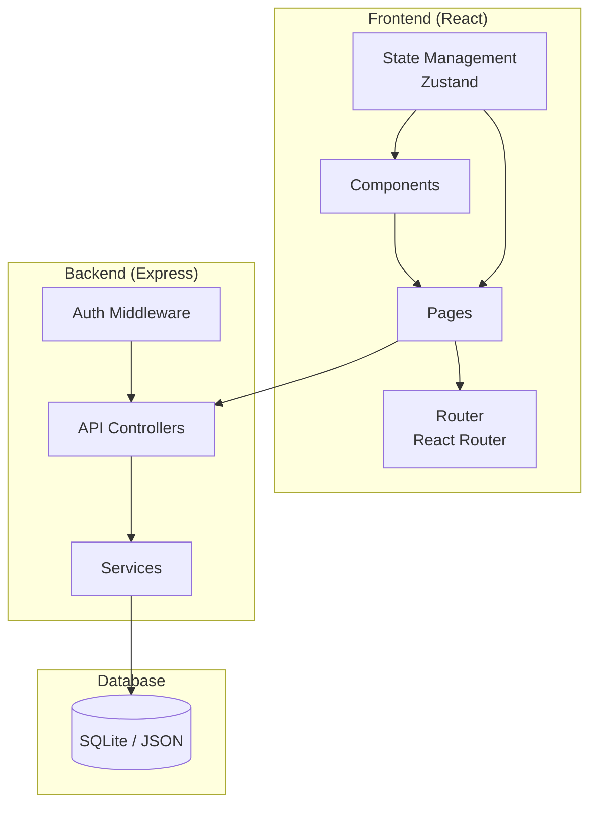
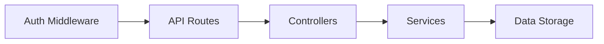
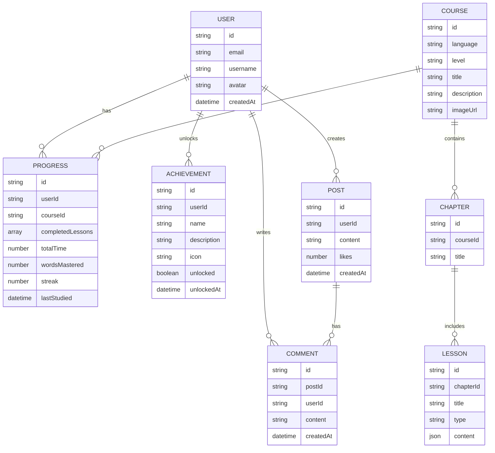

# 多语种学习在线教育平台 - 技术架构文档

## 1. Architecture Design



## 2. Technology Description
- **Frontend**: React@18 + TypeScript + tailwindcss@3 + Vite
- **Initialization Tool**: vite-init
- **Backend**: Express@4 + TypeScript
- **Database**: Local JSON storage (for demo) / SQLite
- **State Management**: Zustand
- **Routing**: React Router DOM
- **Icons**: Lucide React
- **Charts**: Recharts

## 3. Route Definitions

| Route | Purpose |
|-------|---------|
| / | 首页 - 语言选择、课程概览 |
| /courses | 课程页面 - 课程列表和筛选 |
| /courses/:id | 课程详情页 |
| /learn/words | 单词记忆模块 |
| /learn/grammar | 语法练习模块 |
| /learn/speaking | 口语跟读模块 |
| /learn/listening | 听力训练模块 |
| /progress | 进度追踪页面 |
| /profile | 个人中心 |
| /community | 社区页面 |
| /login | 登录页面 |
| /register | 注册页面 |

## 4. API Definitions

### Types
```typescript
interface User {
  id: string;
  email: string;
  username: string;
  avatar?: string;
  createdAt: string;
}

interface Course {
  id: string;
  language: 'en' | 'ja' | 'ko';
  level: 'beginner' | 'intermediate' | 'advanced';
  title: string;
  description: string;
  chapters: Chapter[];
  imageUrl: string;
}

interface Chapter {
  id: string;
  title: string;
  lessons: Lesson[];
}

interface Lesson {
  id: string;
  title: string;
  type: 'words' | 'grammar' | 'speaking' | 'listening';
  content: any;
}

interface Word {
  id: string;
  term: string;
  translation: string;
  pronunciation: string;
  example: string;
  imageUrl?: string;
}

interface Progress {
  userId: string;
  courseId: string;
  completedLessons: string[];
  totalTime: number;
  wordsMastered: number;
  streak: number;
  lastStudied: string;
}

interface Achievement {
  id: string;
  name: string;
  description: string;
  icon: string;
  unlocked: boolean;
}

interface Post {
  id: string;
  userId: string;
  username: string;
  avatar?: string;
  content: string;
  likes: number;
  comments: Comment[];
  createdAt: string;
}

interface Comment {
  id: string;
  userId: string;
  username: string;
  content: string;
  createdAt: string;
}
```

### API Endpoints
- `GET /api/courses` - 获取课程列表
- `GET /api/courses/:id` - 获取课程详情
- `GET /api/words/:language` - 获取单词列表
- `GET /api/progress/:userId` - 获取学习进度
- `POST /api/progress` - 更新学习进度
- `GET /api/achievements/:userId` - 获取成就列表
- `GET /api/community/posts` - 获取社区帖子
- `POST /api/community/posts` - 创建帖子
- `POST /api/auth/login` - 用户登录
- `POST /api/auth/register` - 用户注册

## 5. Server Architecture Diagram



## 6. Data Model

### 6.1 Data Model Definition



### 6.2 Data Definition (JSON Storage)

**Initial Data Structure:**

```json
{
  "users": [],
  "courses": [
    {
      "id": "1",
      "language": "en",
      "level": "beginner",
      "title": "英语入门",
      "description": "从零开始学习英语基础",
      "imageUrl": "https://images.unsplash.com/photo-1546410531-bb4caa6b424d?w=800",
      "chapters": [
        {
          "id": "c1",
          "title": "基础问候",
          "lessons": [
            { "id": "l1", "title": "单词学习", "type": "words" },
            { "id": "l2", "title": "语法练习", "type": "grammar" }
          ]
        }
      ]
    }
  ],
  "words": {
    "en": [
      { "id": "w1", "term": "Hello", "translation": "你好", "pronunciation": "/həˈloʊ/", "example": "Hello, nice to meet you!" }
    ],
    "ja": [
      { "id": "wj1", "term": "こんにちは", "translation": "你好", "pronunciation": "konnichiwa", "example": "こんにちは、元気ですか？" }
    ],
    "ko": [
      { "id": "wk1", "term": "안녕하세요", "translation": "你好", "pronunciation": "annyeonghaseyo", "example": "안녕하세요, 만나서 반갑습니다!" }
    ]
  },
  "progress": [],
  "achievements": [],
  "posts": []
}
```
