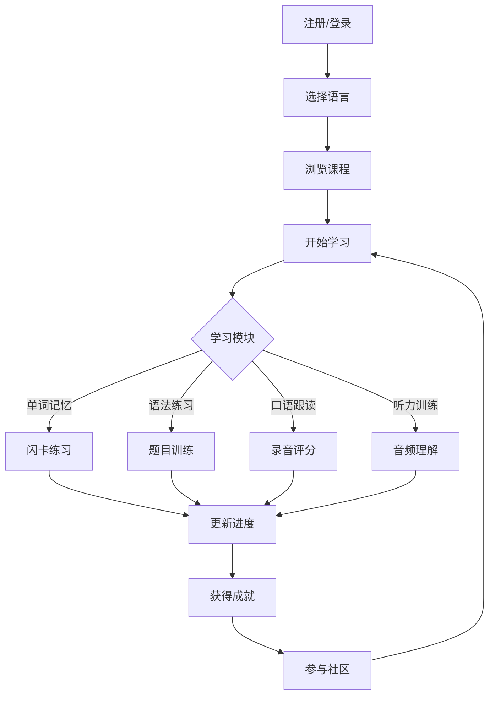

# 多语种学习在线教育平台 - 产品需求文档

## 1. Product Overview
多语种学习在线教育平台是一款沉浸式语言学习应用，支持英语、日语、韩语等主流语言，通过分级课程、互动模块和社区交流帮助用户高效学习语言。

## 2. Core Features

### 2.1 User Roles
| Role | Registration Method | Core Permissions |
|------|---------------------|------------------|
| Normal User | Email/Phone registration | 使用所有学习功能、参与社区、查看成就 |

### 2.2 Feature Module
1. **首页**: 语言选择、课程概览、学习进度
2. **课程页面**: 分级课程体系、课程内容展示
3. **学习模块**: 单词记忆、语法练习、口语跟读、听力训练
4. **进度追踪**: 学习时长、完成课程、掌握单词统计
5. **个人中心**: 用户信息、学习路径推荐、成就系统
6. **社区**: 学习分享、话题讨论、用户互动
7. **登录/注册**: 用户认证功能

### 2.3 Page Details
| Page Name | Module Name | Feature description |
|-----------|-------------|---------------------|
| 首页 | Hero Section | 语言选择、快速开始学习 |
| 首页 | 学习进度卡片 | 今日学习、总体进度展示 |
| 课程页面 | 课程列表 | 按语言和级别筛选课程 |
| 课程页面 | 课程详情 | 课程介绍、章节列表、开始学习 |
| 学习模块 | 单词记忆 | 闪卡模式、听写练习、复习功能 |
| 学习模块 | 语法练习 | 选择题、填空题、解析说明 |
| 学习模块 | 口语跟读 | 录音对比、发音评分 |
| 学习模块 | 听力训练 | 音频播放、理解测试 |
| 进度追踪 | 数据仪表盘 | 图表展示学习数据 |
| 个人中心 | 学习路径 | 基于进度的个性化推荐 |
| 个人中心 | 成就徽章 | 展示已获得成就 |
| 社区 | 动态流 | 用户分享、点赞评论 |
| 登录/注册 | 认证表单 | 邮箱/手机号注册登录 |

## 3. Core Process

用户注册登录 → 选择学习语言 → 浏览分级课程 → 开始学习（单词/语法/口语/听力）→ 查看学习进度 → 获得成就 → 参与社区交流

## 4. User Interface Design

### 4.1 Design Style
- **Primary Color**: 深蓝色 (#1E40AF) - 代表专业和学习
- **Accent Colors**: 活力橙 (#F97316)、清新绿 (#10B981)、优雅紫 (#8B5CF6)
- **Button Style**: 圆角设计，带有微动画和阴影效果
- **Fonts**: 主字体 Noto Sans，标题使用粗体，正文清晰易读
- **Layout Style**: 卡片式布局，清晰的视觉层次
- **Icon Style**: 使用 Lucide React 图标库，简洁现代

### 4.2 Page Design Overview
| Page Name | Module Name | UI Elements |
|-----------|-------------|-------------|
| 首页 | Hero Section | 渐变背景、语言选择按钮、动画效果 |
| 课程页面 | 课程列表 | 网格布局、课程卡片、筛选器 |
| 学习模块 | 互动界面 | 大卡片、进度条、反馈动画 |
| 进度追踪 | 仪表盘 | 图表组件、统计数字、进度条 |
| 个人中心 | 成就系统 | 徽章展示、解锁动画 |
| 社区 | 动态流 | 卡片式帖子、互动按钮 |

### 4.3 Responsiveness
- Desktop-first 设计，移动端自适应
- 响应式断点：1280px、1024px、768px、640px
- 触摸优化：足够大的点击区域，流畅的滑动手势

### 4.4 Animation and Micro-interactions
- 页面加载时的渐入动画
- 按钮悬停和点击效果
- 学习进度更新的动画反馈
- 成就解锁的庆祝动画
